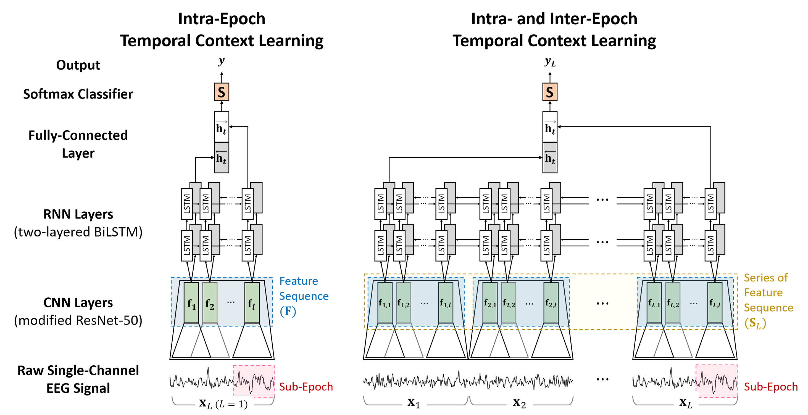

# IITNet

By Hogeon Seo, Seunghyeok Back, Seongju Lee, Deokhwan Park, Tae Kim, and Kyoobin Lee

This repo is the official implementation of "***Intra- and Inter-epoch Temporal Context Network (IITNet) using Sub-epoch Features for Automatic Sleep Scoring on Raw Single-channel EEG***".

This work has been accepted for publication in [Biomedical Signal Processing and Control](https://www.journals.elsevier.com/biomedical-signal-processing-and-control).

The architecture of IITNet:


## Environment ##
* python >=3.7.0
* pytorch >= 1.7.0 (or compatible version to your develop env)
* numpy
* scikit-learn
* terminaltables
* termcolor

1. Install PyTorch with compatible version to your develop env from [PyTorch official website](https://pytorch.org/).
2. Install remaining libraries using the following command.
    ```
    pip install -r requirements.txt
    ```


## Dataset Preparation ##
Download MASS, SHHS, Sleep-EDF and preprocess the edf file using the preprocessing file into NPZ file. The following structure
```
datasets
├── MASS
│   └── F4-EOG
│       ├── 01-03-0001-PSG.npz
│       ├── ...
│       └── 01-03-0064-PSG.npz
├── SHHS
│   └── C4-A1
│       ├── shhs1-200001.npz
│       ├── ...
│       └── shhs1-205804.npz
└── Sleep-EDF
    └── Fpz-Cz
        ├── SC4001E0.npz
        ├── ...
        └── SC4192E0.npz
```

## How to Train and Evaluate ##
You can simply train and evaluate IITNet using just ```main.py```.
```
$ python main.py --config $CONFIG_NAME --gpu GPU
```
### Example Commands ###
* Train and Evaluation Command on MASS (L=10)
```
$ python main.py --config IITNet_MASS_SL-10
```
* Train and Evaluation Command on SHHS (L=10)
```
$ python main.py --config IITNet_SHHS_SL-10
```
* Train and Evaluation Command on Sleep-EDF (L=10)
```
$ python main.py --config IITNet_Sleep-EDF_SL-10
```


## Citation ##
If you find this project useful, we would be grateful if you cite our work as follows:

    @article{seo2020intra,
    title={Intra-and inter-epoch temporal context network (IITNet) using sub-epoch features for automatic sleep scoring on raw single-channel EEG},
    author={Seo, Hogeon and Back, Seunghyeok and Lee, Seongju and Park, Deokhwan and Kim, Tae and Lee, Kyoobin},
    journal={Biomedical Signal Processing and Control},
    volume={61},
    pages={102037},
    year={2020},
    publisher={Elsevier}
    }

## Acknowledgement ##
This work was supported by the Institute of Integrated Technology (IIT) Research Project through a grant provided by Gwangju Institute of Science and Technology (GIST) in 2019 (Project Code:
GK11470).

## Licence ##
* 